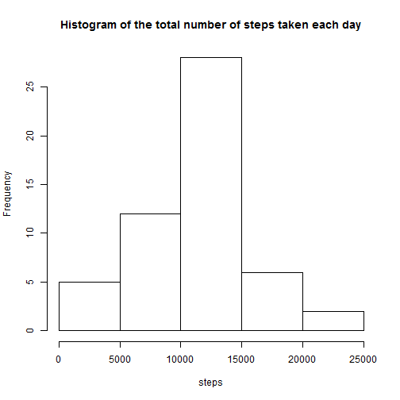
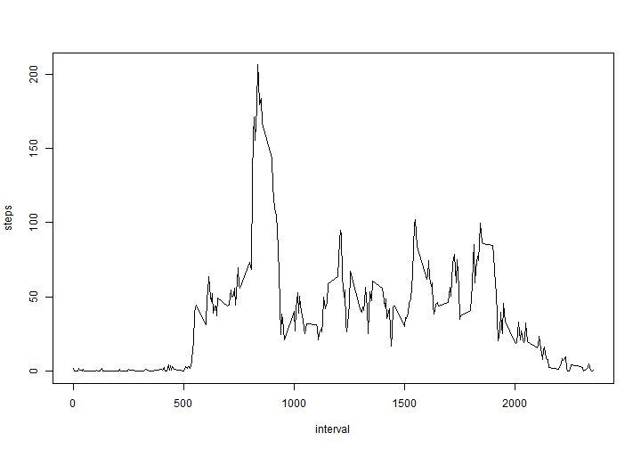
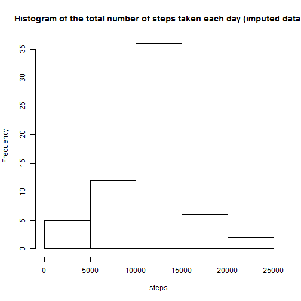

# Reproducible Research: Peer Assessment 1
This assignment is part of the Coursera course Reproducible Research.
Activity monitoring data will be used here as an accessory to demonstrate our
capacity to make a literate statistical program.
You can find more information about it in the `README.md` document.

## Loading and preprocessing the data
The data are already in the working directory in the `activity.zip` file.
Thus, there is no need to download the file from the
[url provided](https://d396qusza40orc.cloudfront.net/repdata%2Fdata%2Factivity.zip).

If not already done, we can unzip the dataset we are going to work with:

```r
datasetPath <- "activity.csv"
if (!file.exists(datasetPath)) unzip("activity.zip")
```


### Loading
The variables included in this dataset are:

* **steps**: Number of steps taking in a 5-minute interval (missing
    values are coded as `NA`).

* **date**: The date on which the measurement was taken in YYYY-MM-DD
    format.

* **interval**: Identifier for the 5-minute interval in which
    measurement was taken.

We can use the `read.csv()` function with the default values knowing:

* The CSV file has headers.

* The NAs are encoded as `NA`.

Therefore, we can load the data using specified types for each variable:

```r
dataset <- read.csv(datasetPath, colClasses = c("numeric", "Date", "numeric"))
```


### Preprocessing
The interval is actualy a time value without seperator or leading zero.

```r
unique(dataset$interval)
```

```
##   [1]    0    5   10   15   20   25   30   35   40   45   50   55  100  105
##  [15]  110  115  120  125  130  135  140  145  150  155  200  205  210  215
##  [29]  220  225  230  235  240  245  250  255  300  305  310  315  320  325
##  [43]  330  335  340  345  350  355  400  405  410  415  420  425  430  435
##  [57]  440  445  450  455  500  505  510  515  520  525  530  535  540  545
##  [71]  550  555  600  605  610  615  620  625  630  635  640  645  650  655
##  [85]  700  705  710  715  720  725  730  735  740  745  750  755  800  805
##  [99]  810  815  820  825  830  835  840  845  850  855  900  905  910  915
## [113]  920  925  930  935  940  945  950  955 1000 1005 1010 1015 1020 1025
## [127] 1030 1035 1040 1045 1050 1055 1100 1105 1110 1115 1120 1125 1130 1135
## [141] 1140 1145 1150 1155 1200 1205 1210 1215 1220 1225 1230 1235 1240 1245
## [155] 1250 1255 1300 1305 1310 1315 1320 1325 1330 1335 1340 1345 1350 1355
## [169] 1400 1405 1410 1415 1420 1425 1430 1435 1440 1445 1450 1455 1500 1505
## [183] 1510 1515 1520 1525 1530 1535 1540 1545 1550 1555 1600 1605 1610 1615
## [197] 1620 1625 1630 1635 1640 1645 1650 1655 1700 1705 1710 1715 1720 1725
## [211] 1730 1735 1740 1745 1750 1755 1800 1805 1810 1815 1820 1825 1830 1835
## [225] 1840 1845 1850 1855 1900 1905 1910 1915 1920 1925 1930 1935 1940 1945
## [239] 1950 1955 2000 2005 2010 2015 2020 2025 2030 2035 2040 2045 2050 2055
## [253] 2100 2105 2110 2115 2120 2125 2130 2135 2140 2145 2150 2155 2200 2205
## [267] 2210 2215 2220 2225 2230 2235 2240 2245 2250 2255 2300 2305 2310 2315
## [281] 2320 2325 2330 2335 2340 2345 2350 2355
```

It has the structure of the time, with the last two digits never above 60 and
the first two never above 24.

We can then try the rebuild a proper timestamp with it:

```r
dataset$datetime <- strptime(
    
    paste(
        dataset$date,
        # Adding trailing zeros
        formatC(dataset$interval, width = 4, format = "d", flag = "0")
        ),
    
    format="%Y-%m-%d %H%M"
    
    )
summary(dataset["datetime"])
```

```
##     datetime                  
##  Min.   :2012-10-01 00:00:00  
##  1st Qu.:2012-10-16 05:58:45  
##  Median :2012-10-31 11:57:30  
##  Mean   :2012-10-31 12:23:58  
##  3rd Qu.:2012-11-15 17:56:15  
##  Max.   :2012-11-30 23:55:00
```


## What is mean total number of steps taken per day?
For the following question, I will use `ddply` from the `plyr` package to
summarize with ease the data.

```r
library(plyr)
```

```
## Warning: package 'plyr' was built under R version 3.0.3
```


We are going to summarize the data to have the total number of steps per day.
We collapse on the `date` column and we sum the steps.

Just for information purpose and to have an idea of the quality of the dataset
I also added the number of observation per day that are summed.


```r
dailySteps <- ddply(dataset, .(date), summarize, observations = sum(!is.na(steps)), 
    steps = sum(steps))
```


```r
head(dailySteps)
```

```
##         date observations steps
## 1 2012-10-01            0    NA
## 2 2012-10-02          288   126
## 3 2012-10-03          288 11352
## 4 2012-10-04          288 12116
## 5 2012-10-05          288 13294
## 6 2012-10-06          288 15420
```

```r
unique(dailySteps$observations)
```

```
## [1]   0 288
```


We can see that the number of observation per day is constant
(288) or you just have no observation.
That mean we didn't remove any observation in the middle of a day. Therefore,
we won't find a NA because of partial data per day.

### 1. Make a histogram of the total number of steps taken each day

We can now make a histogram of the daily data

```r
with(dailySteps, hist(steps, main = "Histogram of the total number of steps taken each day"))
```

 


### 2. Calculate and report the **mean** and **median** total number of steps taken per day
`dailSteps` contains the 

```r
stepsMean <- mean(dailySteps$steps, na.rm = T)
stepsMedian <- median(dailySteps$steps, na.rm = T)
stepsMean
```

```
## [1] 10766
```

```r
stepsMedian
```

```
## [1] 10765
```


So, each day, we have a mean of 10766.1886792453 and a median of 10765.

## What is the average daily activity pattern?

For this question we have to compute another summary of the data, average of steps by interval:


```r

intervalSteps <- ddply(dataset, .(interval), summarize, steps = mean(steps, 
    na.rm = T))
```


### 1. Make a time series plot (i.e. `type = "l"`) of the 5-minute interval (x-axis) and the average number of steps taken, averaged across all days (y-axis)
It is then possible the draw the plot of `interval` data:

```r
with(intervalSteps, plot(type = "l", x = interval, y = steps))
```

 


### 2. Which 5-minute interval, on average across all the days in the dataset, contains the maximum number of steps?
The maximum number of steps is given by:

```r
maxStepsInterval <- intervalSteps[intervalSteps$steps == max(intervalSteps$steps), 
    ]
maxStepsInterval
```

```
##     interval steps
## 104      835 206.2
```

The interval where the maximum steps (206.1698) are made is
*835*.
It means it starts at the time *08:35* and ends 5 minutes later.

## Imputing missing values

We can simply find the number of missing 

```r
missingObservation <- is.na(dataset$steps)
sum(missingObservation)
```

```
## [1] 2304
```

There are *2304* missing values in the dataset.
Actually, it's 8 full days missing.

We are going to use the averaged interval data to complete the dataset.
That way we will recreate average days that will have features really close to
the original dataset.
Also, we will round the number of steps to have data that look plosible.


```r
datasetImputed <- dataset

# listing interval steps to have faster lookups.
listIntervalSteps <- as.list(round(intervalSteps$steps))
names(listIntervalSteps) <- as.character(intervalSteps$interval)

# processing each na row
datasetImputed[is.na(dataset$steps), "steps"] <- unlist(listIntervalSteps[as.character(datasetImputed[is.na(dataset$steps), 
    "interval"])])
```


### 4. Make a histogram of the total number of steps taken each day and Calculate and report the **mean** and **median** total number of steps taken per day. Do these values differ from the estimates from the first part of the assignment? What is the impact of imputing missing data on the estimates of the total daily number of steps?
We reapply the same analysis as the original dataset:

```r
dailyStepsImputed <- ddply(datasetImputed, .(date), summarize, observations = sum(!is.na(steps)), 
    steps = sum(steps))
with(dailyStepsImputed, hist(steps, main = "Histogram of the total number of steps taken each day (imputed data)"))
```

 

```r
stepsMeanImputed <- mean(dailyStepsImputed$steps, na.rm = T)
stepsMedianImputed <- median(dailyStepsImputed$steps, na.rm = T)
```


By comparing the new histogram we find that the frequencies are stressed more. The high frequencies are higher, low ones are lower.
Also the mean ande median of each dataset are:
* **Means** original: 10766.1886792453, imputed: 10765.6393442623.
* **Medians** original: 10765, imputed: 10762.

We see little differences from the estimate from the first part of the assigment.
The impact of imputing the data is that even when using data with specific features that we are looking for we are having an impact on the dataset and can reproduce a perfect set.

## Are there differences in activity patterns between weekdays and weekends?
We are going to add the distinction between weekday and weekend in the dataset.

### 1. Create a new factor variable in the dataset with two levels -- "weekday" and "weekend" indicating whether a given date is a weekday or weekend day.

```r
weekdaysList <- weekdays(dataset$date)
weekdaysList[!(weekdaysList %in% c("Saturday", "Sunday"))] <- "weekday"
weekdaysList[(weekdaysList %in% c("Saturday", "Sunday"))] <- "weekend"
datasetImputed$weekday <- as.factor(weekdaysList)
```

### 2. Make a panel plot containing a time series plot (i.e. `type = "l"`) of the 5-minute interval (x-axis) and the average number of steps taken, averaged across all weekday days or weekend days (y-axis). The plot should look something like the following, which was creating using **simulated data**:

We have to average the daily data to obtain the pattern across all days in the week and weekend.

```r
dailyStepsByWeekdayImputed <- ddply(datasetImputed, c("interval", "weekday"), 
    summarize, steps = mean(steps))
library(lattice)
xyplot(steps ~ interval | weekday, data = dailyStepsByWeekdayImputed, layout = c(1, 
    2), type = "l", xlab = "Interval", ylab = "Number of steps")
```

 


We can see the same patterns. You have 4 distinctive high activity periods at 8am, 12pm, 4pm, 7pm. This is explained by the meals/snacks times. Then where the patterns differ between the two periods are between 5am and 8am (more activity during the weekdays), and also globally during the rest of the day there are more activity during the weekend. This is explained easily by work hours where people tend to be sitting at there desk when they are potentialy moving during the weekend.

